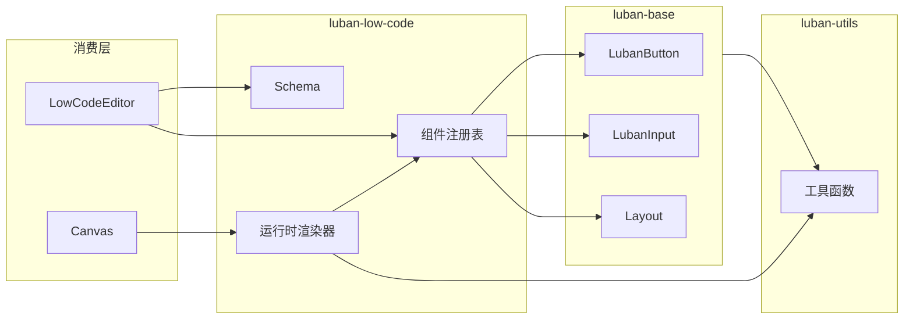
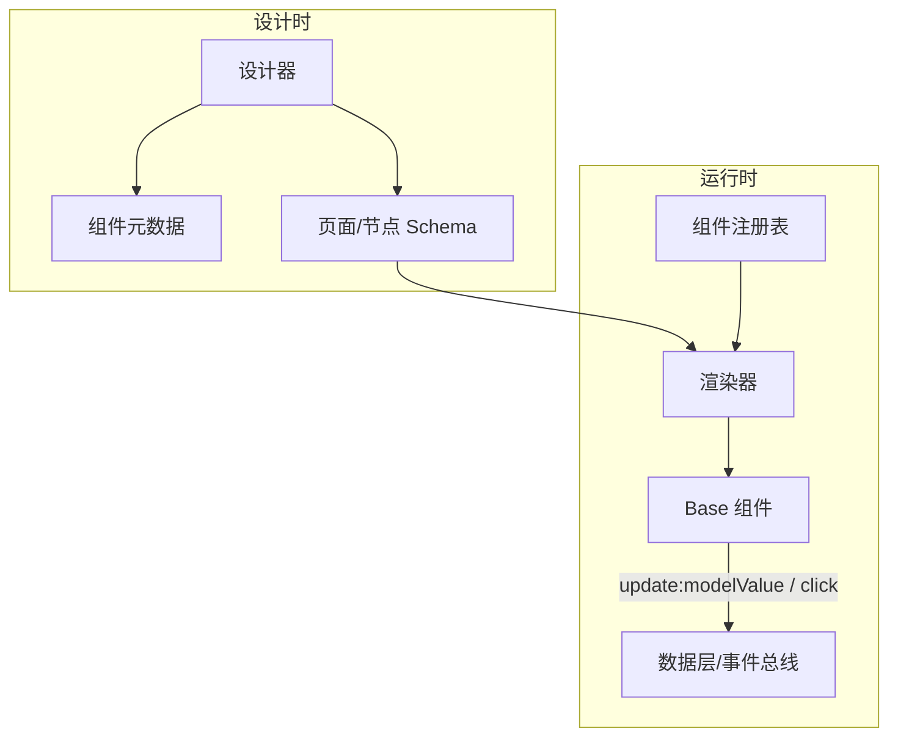

# 底层 Vue3 组件库架构说明

本文档定义本仓库在大型低代码项目中的角色、组件契约、目录约定、Base 与 Low-Code 层的数据流与扩展方式，作为底层 Vue3 组件开发的规范与设计基准。

---

## 1. 整体定位与分层

本仓库是低代码平台的 **底层 UI 组件库**，被上层低代码引擎/设计器消费；与同目录下的其他项目（如设计器、运行时）协同工作。

### 分层结构



- **luban-base**：原子级 Vue3 组件（按钮、输入框、布局、表单控件等），不感知低代码；仅通过 props、events、slots 与外部交互。
- **luban-low-code**：基于 base 组件的可配置/可拖拽层，负责 schema 解析、组件注册、属性面板绑定、根据 schema 渲染 base 组件。
- **luban-utils**：纯逻辑与工具函数，无 UI，可被 base 与 low-code 共用。

---

## 2. 组件契约（Base 层必须遵守的约定）

所有 `luban-base` 组件需遵守以下契约，以便 low-code 统一绑定与生成配置。

### 实现方式

- 使用 Vue 3 `defineComponent`，TypeScript 编写，通过 `vite-plugin-dts` 产出 `.d.ts`（见 [packages/luban-base/vite.config.mts](../packages/luban-base/vite.config.mts)）。
- 组件名统一 **LubanXxx**，文件名与导出名一致（如 `LubanButton` 在 `LubanButton.vue` 或 `button/` 目录下导出）。

### 表单/有值组件

- 必须支持 **v-model**：`modelValue` + `update:modelValue`，值类型明确（string / number / boolean / null 等）。
- 建议支持：`label`、`name`、`required`、`disabled`、`helperText`、`error`、`errorMessage`（与现有表单组件一致），便于表单收集与校验。

### 无值组件

- 通过 **props** 配置，通过 **events**（如 `click`）与 **slots**（如 `default`）与外部交互；不在组件内部维护“表单值”。

### 通用约定

- 可交互组件统一支持 **disabled**（若适用）。
- 样式遵循 [CLAUDE.md](../CLAUDE.md) 的 Material Design 与响应式；组件仅使用自身 class（如 `lb-*`），不依赖全局业务 class，便于在画布中独立渲染。

### Base 组件契约表

| 组件名          | 类型 | 主要 props                                                                             | model 类型               | events                         | slots   |
| --------------- | ---- | -------------------------------------------------------------------------------------- | ------------------------ | ------------------------------ | ------- |
| LubanButton     | 无值 | variant, color, disabled, block, type                                                  | —                        | click                          | default |
| LubanContainer  | 无值 | maxWidth, padded                                                                       | —                        | —                              | default |
| LubanRow        | 无值 | align, justify, direction, gap, wrap                                                   | —                        | —                              | default |
| LubanCol        | 无值 | grow, basis, alignSelf                                                                 | —                        | —                              | default |
| LubanBanner     | 无值 | src, alt, href?, height?, objectFit?                                                   | —                        | click                          | —       |
| LubanText       | 无值 | tag, variant, secondary?, content?                                                     | —                        | —                              | default |
| LubanInput      | 值   | label, type, placeholder, required, disabled, name, helperText, error, errorMessage    | string                   | update:modelValue, blur, focus | —       |
| LubanTextArea   | 值   | label, placeholder, required, disabled, rows, name, helperText, error, errorMessage    | string                   | update:modelValue, blur, focus | —       |
| LubanSelect     | 值   | label, placeholder, options, required, disabled, name, helperText, error, errorMessage | string \| number \| null | update:modelValue, blur, focus | —       |
| LubanCheckbox   | 值   | label, required, disabled, name                                                        | boolean                  | update:modelValue              | —       |
| LubanRadioGroup | 值   | label, name, options, required, disabled                                               | string \| number \| null | update:modelValue              | —       |
| LubanSwitch     | 值   | label, disabled, name                                                                  | boolean                  | update:modelValue              | —       |

---

## 3. 目录与文件结构约定

### luban-base

- 组件按 **类别** 分子目录：`layout/`、`button/`、`form/` 等；每类下单文件或单目录（与现有一致）。
- 每个组件对应：
  - `ComponentName.vue`（单文件组件，含 `<template>`）或同目录下的 `*.ts`；
  - 可选 `*.spec.ts`（单测）；
  - 可选 `*.stories.ts`（Storybook）。
- 样式使用 SASS，集中在 `src/styles/` 下按模块拆分：`button.scss`、`form.scss`、`layout.scss`；与主题相关的颜色、间距、圆角、阴影、断点等提取到 **`_variables.scss`**，各模块通过 `@use './variables'` 引用，便于主题扩展。
- 组件实现优先使用单文件组件 **`.vue`**，内含 `<template>`，与「内容模板使用 Vue template」约定一致。
- 入口 [packages/luban-base/src/index.ts](../packages/luban-base/src/index.ts) 仅做 re-export，不写业务逻辑。

### luban-low-code（预留）

- 建议子目录：
  - `schema/`：组件与页面 schema 类型定义；
  - `registry/`：组件注册表（组件引用 + props/events 元数据）；
  - `runtime/`：根据 schema 渲染 base 组件的包装器或渲染器。

### 跨包引用

- 统一通过包名引用：`@luban-low-code/luban-base`、`@luban-low-code/luban-low-code`、`@luban-ui/luban-utils`。
- 在 app 中通过 [apps/luban-ui/vite.config.mts](../apps/luban-ui/vite.config.mts) 的 `resolve.alias` 将包名指向本地源码；[tsconfig.base.json](../tsconfig.base.json) 的 `paths` 与 `customConditions` 用于开发态类型与源码解析。避免在包之间使用相对路径跨包引用。

---

## 4. Base ↔ Low-Code 数据流与对接方式

### 设计时（拖拽/配置）

- low-code 层维护一份 **组件元数据**：组件类型名、分类、props schema（类型、默认值、是否必填）、可绑定事件。元数据可与 base 组件的 TypeScript 类型约定一致，后续可由脚本或手写从 base 导出。
- 画布上保存的为 **页面/节点 schema**（节点类型、props、children、绑定事件等），不直接存储 Vue 组件实例。

### 运行时（预览/发布）

- low-code 的 **运行时** 根据 schema 从 **组件注册表** 取到对应的 base 组件（如 `LubanButton`、`LubanInput`），将 schema 中的 props 透传给 base 组件；对“值组件”将 v-model 绑定到运行时数据模型（如 `formState[key]`）。
- 事件（如 `update:modelValue`、`click`）回写到 low-code 的数据层或事件总线，由上层处理。

### 表单校验（设计器可配置）

- 表单项节点可在 **props.rules** 中配置校验规则（`ValidationRule[]`），由运行时在值变更与失焦时执行 `validate(value, rules)`，并将结果通过 **error** / **errorMessage** 传给 base 组件。
- 支持的规则（均为 JSON 可序列化，便于设计器配置）：**required**、**type**（email / tel / url / number）、**minLength** / **maxLength**、**min** / **max**、**pattern**（正则字符串）、每条规则可配 **message**。Checkbox/Switch 的 required 表示“必须勾选”。
- 类型与 API：`@luban-low-code/luban-low-code` 导出 `ValidationRule`、`validate()`，供设计器或外部校验复用。



### 注册表推荐结构

便于后续实现，推荐结构示例（仅作文档约定，不强制实现形式）：

- `Map<componentType, ComponentMeta>`
- `ComponentMeta`: `{ component: VueComponent, propSchema: PropSchema, defaultProps: Record<string, unknown>, events: string[] }`

---

## 5. 扩展方式

### 新增 Base 组件

1. 在 `luban-base` 中按 §2 契约与 §3 目录约定实现组件（`defineComponent`、props、emits、slots）。
2. 编写单测（`*.spec.ts`）与 Storybook（`*.stories.ts`）。
3. 在 [packages/luban-base/src/index.ts](../packages/luban-base/src/index.ts) 中导出。
4. 若为表单/值组件，在本文档的「Base 组件契约表」中补充一行。

### 在 Low-Code 中接入新组件

1. 在组件注册表中注册：组件引用 + props/events 元数据（及可选 defaultProps）。
2. 若需扩展 schema，在 schema 类型中增加新组件类型枚举或节点类型。
3. 运行时根据节点类型从注册表取组件并透传 props、绑定 v-model/事件。

---

## 6. 与现有仓库的对应关系

### 已实现的 Base 组件

- **布局**：LubanContainer、LubanRow、LubanCol（无值，仅 props + default slot）。
- **按钮**：LubanButton（无值，props + click + default slot）。
- **表单**：LubanInput、LubanTextArea、LubanSelect、LubanCheckbox、LubanRadioGroup、LubanSwitch（均为值组件，v-model + 上表所列 props/events）。

上述组件已满足 §2 契约，并已在 Storybook 与单测中覆盖。

### luban-low-code 当前状态

- 当前为占位实现（如 `lubanLowCode()` 返回字符串），无 schema、注册表与运行时。
- 后续将按本文档实现：组件元数据与注册表、页面/节点 schema 类型、根据 schema 渲染 base 组件的运行时。

### Schema 接口草案（仅文档）

以下接口仅在文档中约定，供 low-code 实现时参考；是否落成 `types/schema.d.ts` 由实现阶段决定。

```ts
// 组件元数据（设计时 + 注册表）
interface ComponentMeta {
  type: string;
  category: string;
  component: Component;
  propSchema: Record<string, { type: string; default?: unknown; required?: boolean }>;
  defaultProps?: Record<string, unknown>;
  events: string[];
}

// 节点 schema（树形）
interface NodeSchema {
  id: string;
  type: string;
  props?: Record<string, unknown>;
  children?: NodeSchema[];
  eventBindings?: Record<string, string>;
}

// 页面 schema
interface PageSchema {
  root: NodeSchema;
  formState?: Record<string, unknown>;
}
```

---

_文档版本：与当前代码库一致；契约表随 base 组件增删而更新。_
