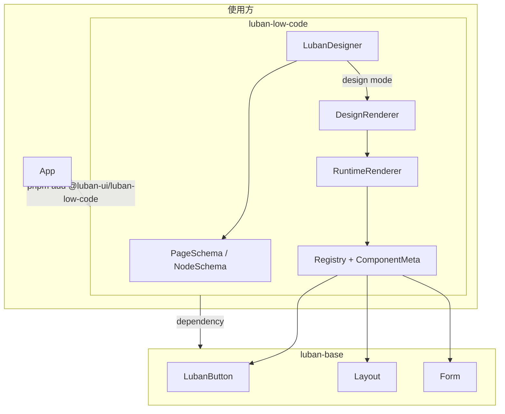

# Low-Code 部分组件设计方案

## 1. Render：按 JSON 渲染，单包安装

### 1.1 现状

- `packages/luban-low-code/src/lib/schema.ts`：已有 `NodeSchema`、`PageSchema`。
- `packages/luban-low-code/src/lib/RuntimeRenderer.vue`：根据 `root` + `formState` 递归渲染，从 registry 取 base 组件。
- `packages/luban-low-code/package.json`：`dependencies` 含 `@luban-ui/luban-base` 和 `vue`。

### 1.2 设计要点

- **按 JSON 渲染**：保持现有契约——调用方传入 `PageSchema`（含 `root: NodeSchema`、可选 `formState`），使用 `RuntimeRenderer` 或封装好的「页面渲染」入口即可。无需改运行时逻辑，只需明确对外 API 与文档。
- **「仅需 pnpm install 一个包」**：保持 `@luban-ui/luban-low-code` 依赖 `@luban-ui/luban-base`（及 `vue`），在文档中说明安装方式，例如：
  - `pnpm add @luban-ui/luban-low-code`
  - 会拉取 `@luban-ui/luban-base` 与 `vue`，业务侧无需再单独安装 base。
- **对外入口**：包入口 `packages/luban-low-code/src/index.ts` 已导出 `RuntimeRenderer`、`PageSchema`、`NodeSchema`、`getComponent`/`registerComponent`。可增加一个便捷用法（可选）：例如 `renderPage(schema)` 或提供一个小型 `<LubanPage :schema="schema" />` 组件，内部仅用 `RuntimeRenderer` + `formState`，便于「仅传 JSON 即渲染」的文档示例。
- **不把 base 打进 low-code 包**：继续用 dependency 方式，避免重复打包、版本分裂和构建复杂度；若未来有「仅发布一个 npm 包」的强需求，再考虑把 base 作为 bundled dependency 或单包发布策略。

---

## 2. Designer：能力与实现思路

### 2.1 拖拽入画布 + 画布内调整顺序（2.1）

- **需求**：从组件面板拖入画布添加组件；画布内已存在组件可再次拖拽以调整顺序（或移动到其他容器）。
- **方案**：采用 **Sortable.js + Vue 3 封装** 的成熟方案，二选一：
  - **vue.draggable.next**（SortableJS 官方 Vue 3 封装）：`v-model` 与列表同步，支持跨列表拖拽（palette → 画布、画布内列表重排）。
  - **sortablejs-vue3**：更轻量的 Sortable.js 包装，API 更贴近原生，便于细粒度控制（如区分「从面板拖入」与「画布内排序」）。
- **实现要点**：
  - **面板 → 画布**：面板为「源列表」（不绑定 schema），画布/容器子节点为「目标列表」；使用 Sortable 的 `group`（如 `{ name: 'components', pull: 'clone', put: true }`）实现从面板 clone 入画布。
  - **画布内排序**：每个「可放置子节点」的容器对应一个 Sortable 实例，绑定 `schema.root.children` 或 `node.children`；拖拽结束时在 `onEnd`/`onAdd` 中更新对应节点的 `children` 数组（增/删/移），保证与 schema 树一致。
  - 将「拖拽源」抽象为：要么来自 palette（新建节点、插入目标容器的 children），要么来自另一容器或同容器内（移动/排序），统一更新同一份 `PageSchema`。

### 2.2 使用社区成熟 JS 库（2.2）

- 推荐 **Sortable.js**（核心） + **Vue 3 封装**（vue.draggable.next 或 sortablejs-vue3），理由：
  - 使用广泛、文档和示例多；支持触摸设备、多列表、拖拽句柄等。
  - 与 Vue 3 的响应式数据（schema 树）可结合：在 Sortable 的 `onAdd`/`onRemove`/`onUpdate` 中同步修改 `node.children`，保证单一数据源。
- 依赖：在 `packages/luban-low-code/package.json` 中增加 `sortablejs` 及上述 Vue 封装之一（如 `vuedraggable` 的 next 版本或 `sortablejs-vue3`）；若设计器仅用于 demo 且不放入 packages，则可在 apps/luban-ui 中安装，避免组件库强依赖拖拽库。

### 2.3 点击组件编辑属性（2.3）

- **选中状态**：设计器维护 `selectedNodeId: string | null`（或 selectedNode 引用），点击画布内某个「设计态节点」时设置选中。
- **属性面板**：右侧（或浮动）属性面板根据 `selectedNodeId` 展示对应节点的 `props`；表单控件（输入、选择、开关等）与 `node.props` 字段一一绑定；修改时写回 `schema` 中对应节点（immutable 更新或响应式赋值），并可选触发 `update:schema`。
- **设计态与运行态区分**：画布在「设计模式」下渲染的是「带包装的」节点：每个节点外层包一层可点击、可拖拽的 wrapper（如 div），点击时选中并高亮，内部再渲染 RuntimeRenderer；或使用同一棵 schema 树，设计器用「设计态渲染器」递归渲染（每个节点 = wrapper + RuntimeRenderer），运行时仅用 RuntimeRenderer。这样点击的是 wrapper，不会与内部按钮等交互冲突。
- **组件元数据**：为支持「可编辑属性」的生成，registry 需扩展为 **ComponentMeta**（类型、label、propSchema、defaultProps 等），便于属性面板根据类型生成表单项（如 LubanButton → variant、color、content 等）；可与现有 ARCHITECTURE.md 中的 ComponentMeta 草案对齐。

### 2.4 布局/容器组件支持拖入（2.4）

- **可放置容器类型**：在 low-code 中定义「可接受子节点的类型」列表，例如：
  - **CONTAINER_TYPES**：`LubanContainer`、`LubanRow`、`LubanCol`（均带 default slot 的布局组件）。
  - 可选：若引入 **LubanForm**（base 中新增一个仅 default slot 的表单容器），则 Form 也作为容器，且可限制仅接受表单类子组件（LubanInput、LubanSelect 等）。
- **放置规则**：每个 CONTAINER_TYPES 的节点对应一个 drop zone，其 `children` 数组即为 Sortable 绑定的列表；从面板或从其他容器拖入时，只能放入这些 drop zone。Sortable 的 `group` 可配置为同一组，使「表单组件」可放入 Container/Row/Col/Form，「布局组件」也可放入 Container/Row/Col（根据产品规则可再细化哪些类型可放入哪些容器）。
- **数据流**：拖入/移动时，仅更新目标节点的 `children` 和（若从别处移出）源节点的 `children`，保持整棵 schema 树一致；formState 在节点增删时按 name 增删键（与现有 demo 的 appendNodeToSchema 逻辑一致）。

### 2.5 空容器的辅助线占位（2.5）

- **何时显示**：当某个节点类型属于 CONTAINER_TYPES 且 `(node.children?.length ?? 0) === 0` 时，在该容器「内部」渲染一个占位区域（辅助线），而不是完全空白。
- **样式**：占位区域使用虚线框 + 最小高度 + 提示文案（如「拖拽组件到此处」），与当前 LubanDesigner 的 placeholder 风格一致；该区域同时作为 Sortable 的 drop zone，保证空容器也可被拖入。
- **何时隐藏**：一旦 `node.children.length > 0`，仅渲染真实子节点（设计态用 wrapper + RuntimeRenderer），不再渲染辅助线；若子节点全是「空容器」，则每个空容器再递归显示自己的辅助线。
- **实现位置**：在「设计态渲染器」中，对 CONTAINER_TYPES 且 children 为空时渲染占位 div（带 Sortable 或统一 drop 处理），否则渲染子节点列表。

---

## 3. 架构关系示意

- **Render 路径**：App 传入 `PageSchema` → `RuntimeRenderer` 从 Registry 取 base 组件并按树渲染；仅依赖 schema + 注册表。
- **Designer 路径**：`LubanDesigner` 持有 schema，内部在设计态使用 DesignRenderer（包装节点 + 占位 + Sortable），点击选中驱动属性面板，拖拽事件更新 schema。

---

## 4. 建议的文件与职责划分

| 区域 | 内容 |
|------|------|
| **packages/luban-low-code** | 保持 schema、registry、RuntimeRenderer、LubanDesigner；新增或扩展：ComponentMeta/componentMeta.ts、设计态用的 DesignRenderer（或集成到 LubanDesigner 内）、CONTAINER_TYPES/放置规则常量；可选导出 `<LubanPage :schema="..." />`。 |
| **设计器拖拽** | Sortable.js + Vue 封装：若设计器作为 low-code 包的一部分对外提供，则在 packages 中增加 sortablejs 等依赖；若设计器仅作为 demo 放在 apps/luban-ui，则依赖加在 app，packages 只提供 schema 更新 API 与占位/选中契约。 |
| **属性面板** | 可放在 packages（LubanDesigner 的 slot 或内置右侧栏）或 apps（demo 自实现）；若做在 packages，需依赖 ComponentMeta 生成表单。 |
| **apps/luban-ui** | 测试设计器页：集成 LubanDesigner、属性面板（若未内置）、组件面板；使用上述 Sortable 方案实现拖入与排序，并调用 schema 更新方法。 |

---

## 5. 实现顺序建议

1. **Render 单包体验**：文档说明安装与用法；可选增加 `LubanPage` 或 `renderPage` 便捷 API；确认 dependency 满足「只装一个包」的体验。
2. **组件元数据**：在 registry 层增加 ComponentMeta（type、category、propSchema、defaultProps），为属性面板和默认 props 提供数据。
3. **设计态渲染与占位**：实现 DesignRenderer（或 LubanDesigner 内逻辑），对 CONTAINER_TYPES 且无子节点时渲染辅助线占位，并标记 drop zone。
4. **拖拽**：引入 Sortable.js + Vue 封装；实现面板（clone）→ 画布、画布内/跨容器排序与移动；所有变更写回 schema。
5. **选中与属性编辑**：设计态节点可点击选中、高亮；属性面板根据 selectedNodeId 与 ComponentMeta 编辑 props 并写回 schema。
6. **容器规则**：固化 CONTAINER_TYPES 与可接受子类型规则，与 Sortable group 配置一致；若需「Form 仅接受表单组件」，在 base 增加 LubanForm 或在 meta 中声明 acceptTypes。

---

以上方案满足：**(1) render 按 JSON、单包安装；(2.1) 拖拽入画布且可再次拖拽调序；(2.2) 使用 Sortable.js 等成熟库；(2.3) 点击编辑属性；(2.4) 布局/容器支持拖入；(2.5) 空容器显示辅助线**。
